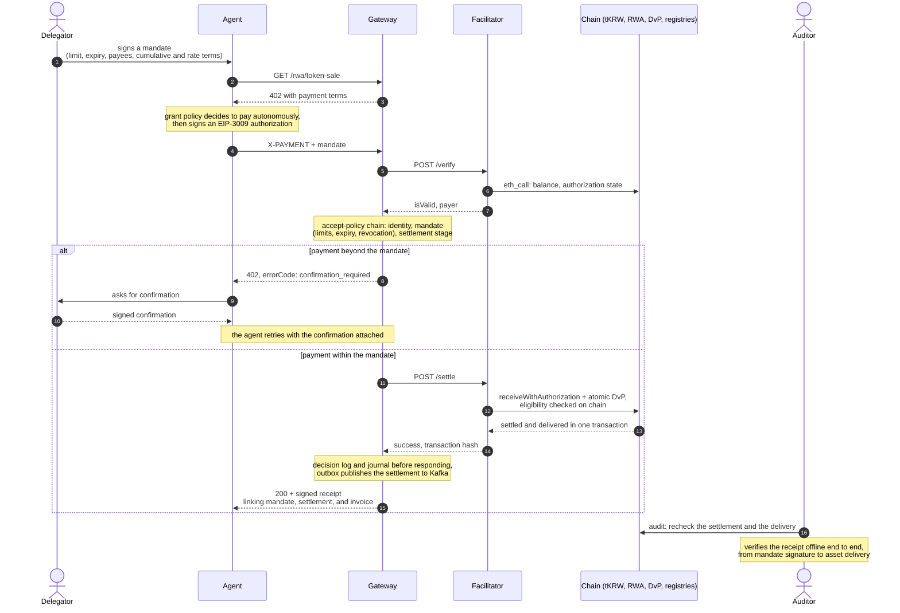
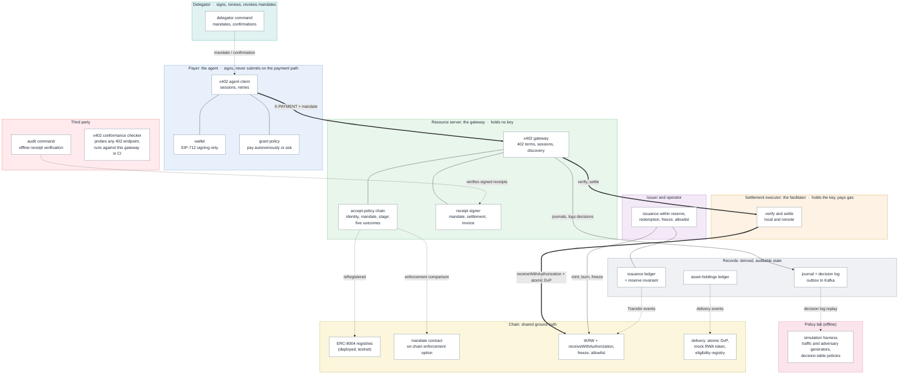

# stablecoin-x402-gateway

[](https://github.com/kfangw/stablecoin-x402-gateway/actions/workflows/ci.yml)

A single Go codebase that implements the issuance and distribution of a test stablecoin, an off-chain ledger reconciled against the chain, and x402 payment settlement for autonomous agents.

The premise is twofold. A stablecoin backend lives or dies on the consistency between on-chain and off-chain state, and the next wave of traffic such infrastructure will serve is not only humans but autonomous AI agents. This repository puts the roles involved, the issuer, the paying agent, the resource-serving gateway, and the settling facilitator, into one runnable system, with an on-chain identity registry deciding which agents may pay. The one-command demo needs no external services.

## Quick start

```bash
go mod tidy   # first build only
go run ./cmd/demo
go test ./...
```

`cmd/demo` runs the steps below on an in-process simulated chain (go-ethereum simulated backend). No node or external service is required.

```
1. Issue      the issuer deploys the tKRW contract and the identity registry, and mints 100,000 tKRW to the agent wallet
2. Protect    the gateway guards a paid resource with x402 and requires a registered agent (price: 500 tKRW)
3. Refuse     an unregistered agent is turned away with errorCode identity_unregistered
4. Register   the agent registers itself in the identity registry (a one-time setup transaction)
5. Pay        the agent reads the 402 response and retries with a signed EIP-3009 authorization, sending no transaction on the payment path
6. Settle     the gateway verifies the signature and settles on-chain, paying for gas
7. Reconcile  the off-chain ledger is checked against on-chain state in three ways
8. Defend     replaying the same signature is rejected
9. Delegate   a delegator signs a mandate and the gateway now also requires one
10. Authorize the agent pays under the mandate, then an over-scope payment is refused with mandate_exceeded
11. Revoke    the delegator withdraws the mandate and the next payment is refused with mandate_revoked
```

## Real node mode

The same code runs against a real RPC node (anvil or a testnet) with the issuer,
gateway, and agent as separate processes. The simulated demo above stays as is.

```bash
# terminal 1: local node
anvil

# terminal 2: issuer deploys the token and mints to the agent
export ISSUER_KEY=0xac0974bec39a17e36ba4a6b4d238ff944bacb478cbed5efcae784d7bf4f2ff80  # anvil key #0
TOKEN=$(go run ./cmd/issuer deploy --rpc http://localhost:8545 | tail -1)
go run ./cmd/issuer mint --rpc http://localhost:8545 --token $TOKEN \
  --to <agent address> --amount 100000

# terminal 3: gateway
export GATEWAY_KEY=0x59c6995e998f97a5a0044966f0945389dc9e86dae88c7a8412f4603b6b78690d  # anvil key #1
go run ./cmd/gateway --rpc http://localhost:8545 --token $TOKEN \
  --listen :8402 --price 500

# terminal 4: agent pays for the resource
export AGENT_KEY=<agent private key>
go run ./cmd/agent get --rpc http://localhost:8545 --token $TOKEN \
  --max 1000 http://localhost:8402/premium/report

# reconcile the off-chain ledger against the node
go run ./cmd/issuer reconcile --rpc http://localhost:8545 --token $TOKEN
```

To require registered agents, deploy the identity registry, start the gateway
with `--identity-registry`, and have the agent register once before paying:

```bash
REGISTRY=$(go run ./cmd/issuer deploy-registry --rpc http://localhost:8545 | tail -1)
go run ./cmd/gateway --rpc http://localhost:8545 --token $TOKEN \
  --listen :8402 --price 500 --identity-registry $REGISTRY
go run ./cmd/agent register --rpc http://localhost:8545 \
  --registry $REGISTRY --card https://cards.example/agent   # one-time setup
```

Keys are passed through environment variables (ISSUER_KEY, GATEWAY_KEY,
AGENT_KEY), not flags, so they never appear in a process listing. The end-to-end
test in `e2e/` runs this flow against a live node when `E2E_RPC_URL` is set and
skips otherwise:

```bash
E2E_RPC_URL=http://localhost:8545 go test ./... -run E2E
```

## Docker Compose

The four-terminal scenario above is packaged as a Compose stack. `up` starts an
anvil node, runs a one-shot init service that deploys the token and the identity
registry and mints to the agents, then starts a redpanda broker, the
facilitator, and the gateway. The gateway runs in remote mode and holds no key:
the facilitator settles on-chain and pays the gas, and the gateway reaches the
node only for read-only identity lookups. It runs with both `--identity-registry`
and `--require-mandate`, so a payment must come from a registered agent and carry
a valid mandate. The gateway journals each settlement to the shared volume and
publishes it to redpanda. The agents are separate `run` steps: `agent` triggers a
one-shot `delegator` that signs a mandate, then registers itself and pays under
the mandate, while `rogue-agent` skips registration and is refused.

```bash
docker compose up -d                # anvil + token/registry deploy + mint + redpanda + facilitator + gateway
curl -s localhost:8402/premium/report     # 402 with the payment terms
docker compose run --rm agent       # signs a mandate, registers, pays under it: HTTP 200, 500 tKRW, settlement tx
docker compose run --rm rogue-agent # never registers: refused with errorCode identity_unregistered
docker compose exec redpanda rpk topic consume settlements -n 1   # the published settlement event
docker compose down -v              # tear down (removes the shared volume)
```

The init service publishes the deployed token address to a shared volume, which
the facilitator, gateway, and agent read, so no address needs to be copied by
hand. Issuance is idempotent, so re-running the stack reuses a single token. The
keys are the publicly known anvil development accounts and hold no real funds.

## Layout

```
contracts/         KRWTestStablecoin.sol, IdentityRegistry.sol, RWATestAsset.sol, EligibilityRegistry.sol, DvPSettlement.sol, DelegatedSpend.sol
token/             tKRW deployment and calls, including freeze and allowlist controls (ABI and bytecode embedded)
registry/          identity registry deployment and calls (ABI and bytecode embedded)
asset/             RWA asset (tRWA) deployment and calls, the asset delivered after settlement
eligibility/       recipient-eligibility registry deployment and calls, with delegator-to-agent inheritance
dvp/               delivery-versus-payment settlement contract deployment and calls
spend/             delegated spending contract deployment and calls, the on-chain mandate enforcer
wallet/            key management and EIP-712 signing (TransferWithAuthorization)
ledger/            token ledger indexed from Transfer events, reconciled against the chain (tKRW issuance and tRWA holdings)
x402/              the payment protocol: gateway (server), facilitator (verify/settle, local or remote), agent (client), accept policies, delivery, refunds, and sessions
internal/nodeutil/ RPC dial and env-key transactor helpers shared by the binaries
cmd/demo/          one-command demo of the whole flow on the simulated backend
cmd/issuer/        issuer CLI: deploy, deploy-registry, mint, reconcile (--asset for the holdings ledger) against a real node
cmd/gateway/       standalone x402 gateway server (built-in or remote facilitator); flags for eligibility, delivery, DvP, sessions, discovery
cmd/facilitator/   facilitator HTTP service: verify, settle (optionally through DvP), supported
cmd/agent/         paying agent CLI: get (pay for a resource, or run a session), discover (list resources), register (join the identity registry)
cmd/delegator/     delegation CLI: sign, confirm, revoke (off-chain), plus deposit, mandate-onchain, revoke-onchain (on-chain enforcement)
sim/               in-process policy lab: seeded workload, attack catalog, delegator responder, and metrics
cmd/sim/           runs the policy lab and compares policy combinations over the same traffic
```

## Design notes

The notes group into three: how a payment is decided and settled, how the pieces are deployed, and how the off-chain records stay honest. Each note links to a fuller design document under [docs/design/](docs/design/).

### The payment path

**Why EIP-3009.** Requiring a paying agent to hold gas is unrealistic. EIP-3009 (transferWithAuthorization) separates the payer from the settlement executor: the payer only signs, and whoever executes settlement pays for gas. This mirrors how the exact scheme of x402 uses USDC's EIP-3009; the tKRW contract here implements the same interface directly. Random 32-byte nonces, unlike sequential ones, let several authorizations be prepared in parallel without collisions, and the contract's usage record blocks replays. Full note: [docs/design/contracts.md](docs/design/contracts.md).

**Order of verification in the gateway.** On-chain submission is expensive and so is on-chain failure. The gateway therefore finishes every off-chain check first: protocol fields (version, scheme, network), payment terms (payee, amount, validity window), signature recovery, then replay and balance checks. Only then does it submit the settlement transaction, and it confirms the receipt status before serving the resource. Full note: [docs/design/gateway.md](docs/design/gateway.md).

**Mandates make delegation checkable.** An agent that pays on someone's behalf should carry proof of what it was authorized to spend. A mandate is an EIP-712 typed grant the delegator signs offline, naming the agent, a per-payment cap, allowed payees and resource prefixes, a validity window, and optional cumulative and rate limits. It rides with the payment as an additive field, so the counterparty can verify the agent's authority without a side channel, and its domain carries the chain id so it cannot be replayed on another chain. The `MandatePolicy` stacks after the identity policy and checks cheapest-first, stateful last: presence, signature, that the payer is the mandated agent, the window, revocation, the allowlists, the per-payment cap, then the cumulative and rate limits. The two window limits are stateful, so the policy reserves a payment's spend when it approves and confirms it only once settlement succeeds; a rejected or failed payment never draws down the budget. The delegator withdraws a grant by signing a revocation of its id, which the gateway records keyed by (delegator, id), so only the mandate's own delegator can revoke it. Each violation returns its own error code (`mandate_missing`, `mandate_invalid`, `mandate_expired`, `mandate_revoked`, `mandate_exceeded`, `mandate_budget_exceeded`, `mandate_rate_exceeded`). The gateway requires mandates only under `--require-mandate`; the `delegator` command signs and revokes them. Full note: [docs/design/mandates.md](docs/design/mandates.md).

**Ask and settlement stages.** Two of the five accept outcomes reserved earlier now do real work. Under `--ask-on-exceed`, a payment that breaches a limit (the per-payment cap or the cumulative budget) is answered with `confirmation_required` and an `ask` naming the exact payment, rather than rejected; entitlement violations (signature, revocation, scope) are never asked. The delegator signs a confirmation bound to that payment's authorization nonce (`delegator confirm`), the agent reattaches it and retries the same authorization, and the gateway lets the over-limit payment through. The gateway keeps a per-delegator confirmation history (asks, accepted confirmations, failed ones) and exposes it to policies. Deferral separates settlement from delivery: under `--defer-above <amount>` a large payment is settled immediately but its resource is withheld, answered with `payment_deferred`; the agent retries the same authorization, and the gateway recognizes the in-flight settlement (rather than treating the reused nonce as a replay), measures how many blocks deep it is, and delivers once it reaches `--confirm-depth`. Delivery removes the in-flight record, so a payment is delivered at most once. The in-flight map and confirmation history are in gateway memory and reset on restart, but a gateway with a journal rebuilds a mandate's cumulative and frequency accounting and its revocation set from the recorded decisions on startup, so a restart does not reopen a budget that was already spent. Full notes: [docs/design/mandates.md](docs/design/mandates.md) and [docs/design/gateway.md](docs/design/gateway.md).

**The accept decision is a policy.** Deployed payment systems differ in their accept rules: some approve optimistically before finality, some verify every payment, some release only after settlement. The gateway makes this rule an explicit, swappable component instead of hard-coded control flow; the default `AlwaysVerify` policy reproduces the original behavior, approving exactly when verification passed. The policy runs before settlement and only decides, so rejecting a payment stops it short of any on-chain transaction. This mirrors how x402 V2 exposes the release decision as a lifecycle hook. A `Decision` carries one of five actions (approve, reject, defer, ask, require-bond) with a machine-readable error code, and a `Chain` evaluates policies in order and returns the first non-approval, so identity, mandate, and verification checks stack without any of them knowing about the others. Only approve settles; every other action becomes a 402 with its own `errorCode`. Full note: [docs/design/gateway.md](docs/design/gateway.md).

**Agent identity.** The gateway can require the paying agent to be registered before it settles. `IdentityRegistry.sol` is a minimal, ERC-8004-style registry that maps an agent address to a registration flag and an agent-card URL; agents self-register with `msg.sender`, matching the registration model of the deployed registries this stands in for. An `IdentityPolicy` stacks after `AlwaysVerify` in the chain, resolves the payer from the verification result, and rejects an unregistered agent with `errorCode: identity_unregistered`; a registry lookup that errors fails closed. The lookup is read-only, so a remote-mode gateway that holds no settlement key gains only a read-only RPC connection for it. The payer never submits a transaction on the payment path (that is the point of the EIP-3009 authorization); registration is a separate, one-time setup transaction the agent sends itself with `agent register`. Enable the check with `--identity-registry <address>`. Full notes: [docs/design/gateway.md](docs/design/gateway.md) and [docs/design/contracts.md](docs/design/contracts.md).

**Asset delivery.** After settlement the gateway can deliver a mock RWA token (`RWATestAsset.sol`, tRWA) to the payer, in one of two modes. The two-transaction flow settles the payment and then transfers the asset as a separate transaction; a delivery failure after settlement is not a silent loss, but a recorded refund of the payment where the gateway holds a key, or an outstanding `refund_pending` journal entry on a keyless gateway. The atomic delivery-versus-payment flow (`DvPSettlement.sol`) instead runs the payment (EIP-3009 to the seller) and the delivery (the seller's asset to the buyer) in one `settleAndDeliver` transaction, so they succeed or revert together. Recipient eligibility, in the spirit of ERC-3643, is checked before settlement (`EligibilityRegistry.sol`, `errorCode: payer_not_eligible`), so an ineligible buyer is stopped before a payment that delivery would only bounce; an agent can inherit eligibility from its delegator, resolved dynamically so revoking the delegator's eligibility removes the agent's at once. The tKRW contract carries issuer freeze and an opt-in transfer allowlist for regulatory control, and a frozen payer is reported at verify rather than on chain. The asset holdings ledger reconciles against the chain exactly like the issuance ledger. Enable with `--asset` (two-transaction), `--dvp` (atomic), and `--eligibility-registry`. Full notes: [docs/design/contracts.md](docs/design/contracts.md) and [docs/design/gateway.md](docs/design/gateway.md).

**On-chain mandates, sessions, and discovery.** The same mandate terms the gateway checks off chain can be enforced on chain: `DelegatedSpend.sol` holds a delegator's deposit and lets the agent spend within a per-payment cap, validity window, payee allowlist, and cumulative budget, checked cheapest-first in the same order as the gateway policy. A parity test runs a shared case table through both enforcers and asserts they agree; the one intended difference, a fixed on-chain budget window versus the gateway's sliding one, is documented as a separated case. Payment sessions let one signed authorization cover many requests: the gateway meters each request against the budget and settles the whole authorization at close (or when it is spent, or the authorization nears expiry), refunding the unused remainder, so a session needs the refund path (`--sessions`). An unauthenticated `GET /resources` lists the gateway's paid resources in the public x402 discovery shape, which `agent discover` consumes. Full notes: [docs/design/contracts.md](docs/design/contracts.md) and [docs/design/gateway.md](docs/design/gateway.md).

**The agent's delegation limit.** The agent refuses payment terms above its delegated limit (MaxAmount). It is a minimal illustration of where a safety boundary belongs when payment authority is delegated to an autonomous agent. Full note: [docs/design/agent.md](docs/design/agent.md).

### The topology

**Splitting out the facilitator.** In the x402 model a resource server can delegate verification and settlement to a facilitator and never touch the chain. The gateway holds a `Facilitator` interface with two implementations: a local one that runs the off-chain checks and submits the transaction in-process, and a remote one that calls a facilitator over HTTP. With the remote facilitator the gateway needs neither an RPC connection nor a private key; it only builds the 402 terms and forwards the payment. The Compose stack is wired this way, so the split shows up in the topology: the settlement key lives on the facilitator service, and the gateway service holds no key at all. Full note: [docs/design/facilitator.md](docs/design/facilitator.md).

The facilitator HTTP service follows the shape of the public x402 facilitator spec:

| Method | Path | Request | Response |
|--------|------|---------|----------|
| POST | `/verify` | `{x402Version, paymentPayload, paymentRequirements}` | `{isValid, invalidReason?, payer?}` (always 200; validity is a field, not a status) |
| POST | `/settle` | same as `/verify` | `{success, transaction, network, payer, errorReason?}` (200 even on a reverted settlement; 5xx only on transport failure) |
| GET | `/supported` | (none) | `{kinds:[{scheme, network}]}` |

```bash
go run ./cmd/facilitator --rpc http://localhost:8545 --token $TOKEN --listen :8403  # FACILITATOR_KEY pays gas
go run ./cmd/gateway --facilitator-url http://localhost:8403 \
  --token $TOKEN --network eip155:31337 --pay-to <payee> --price 500               # no --rpc, no key
```

**One code path for both backends.** The simulated demo and the real node mode drive the same gateway, ledger, and token code. Three seams make that work. The gateway's `Backend` and the ledger's `LogReader` are interfaces that both the simulated backend and `ethclient.Client` satisfy. The gateway's `Commit` hook mines a block on the simulated backend and is left nil against a real node, where `bind.WaitMined` polls for the receipt instead. Chain ID and the x402 network string are read from the node rather than hardcoded. Nothing in the core packages knows which backend it runs on. Full note: [docs/design/facilitator.md](docs/design/facilitator.md).

### The records

**Why the ledger is rebuilt from events.** If the source of record for the off-chain ledger is the chain's event log, the ledger becomes derived state that can be discarded and rebuilt at any time. The `ledger` package re-reads every Transfer event, reconstructs per-account balances and the minted and burned totals, and reconciles them in three ways: minted minus burned against on-chain totalSupply, the sum of account balances against totalSupply, and each account's ledger balance against on-chain balanceOf. The tests include a deliberately faulty reader that drops one event, verifying that reconciliation actually catches indexing gaps. Full note: [docs/design/records.md](docs/design/records.md).

**Incremental indexing and reorgs.** The full rescan stays the verification path, but a live indexer cannot reread from genesis on every block. `SyncIncremental` reads only new blocks and keeps a window of recent blocks keyed by block hash. When a block's stored hash no longer matches the canonical chain, that block and the ones after it are rewound and the new canonical blocks are read in their place, so the same "converge to the chain" rule holds through a reorg. Blocks deeper than a finality depth are merged into the immutable aggregates; a reorg that reaches past that depth is reported as an error rather than silently rewriting settled history. Full note: [docs/design/records.md](docs/design/records.md).

**Durable settlement journal and outbox.** Without a journal the gateway keeps settlements only in memory, so a crash loses the record of what it settled. With `--journal` the gateway writes each settlement to an append-only, fsynced JSONL file before it answers the request, so the settlement is durable by the time the caller learns it succeeded; on restart the file replays to rebuild the in-memory view, and a torn final line from a crash mid-write is dropped. Publishing then follows the outbox pattern: a separate loop scans the journal and delivers unpublished settlements through a `Sink`, marking each published only after the sink acknowledges it. The default sink (`--kafka-brokers`) produces to a Kafka topic, keyed by the settlement transaction hash. Delivery is at-least-once by construction, since a crash between the produce and the marker redelivers the event, so consumers deduplicate on that hash. Journaling and publishing are both opt-in; without the flags every existing path runs unchanged. Full note: [docs/design/records.md](docs/design/records.md).

## The policy lab

`cmd/sim` runs mixed benign and attack traffic through several policy combinations on the in-process simulated chain and reports how each did. Over one seeded workload it compares an unprotected baseline, the built-in mandate rules, and any decision tables you pass. The accept and grant sides are both pluggable: the gateway's accept policy can be a decision table keyed on amount, settlement stage, risk score, and confirmation count, and the agent's grant policy is the symmetric table deciding when to pay, ask, or refuse.

```bash
go run ./cmd/sim --seed 5 --payments 200 --attack-mix 0.3 \
  --accept-table sim/testdata/accept-conservative.json \
  --grant-table sim/testdata/grant-conservative.json
```

Reading the table: each row is one policy combination. `benign done` is the share of normal tasks that completed, the cost a policy imposes on ordinary work; `attacks thru` and `attack loss` are how many attacks settled and what they cost; `escalations` counts how often the agent had to ask the delegator. A protective combination lowers attack loss but usually lowers benign completion and raises escalations, so the columns are read together, never alone. The attack catalog pairs each attack (inflated terms, payee spoofing, an induced repeat purchase) with a benign task of the same shape. `--responder-errors` and `--responder-fatigue` model a delegator that answers confirmation requests imperfectly and tires as questions pile up; `--compare label=accept.json:grant.json` adds more table pairs; `--out report.json` writes the numbers. The same `--seed` reproduces the same report. The harness design is documented in [docs/design/sim.md](docs/design/sim.md).

## Scope and limitations

This repository verifies protocol flows; it is not a production implementation. In particular:

- The contract is unaudited and the token uses zero decimals. Regulatory requirements such as reserve attestation, allowlists, and freezing are out of scope.
- The gateway can run the facilitator in-process or delegate to a remote one, but the facilitator itself is a single instance with no authentication, rate limiting, or horizontal scaling.
- Agent identity uses a minimal local registry that records a registration flag and an agent-card URL. The card is stored but not fetched or validated, and the wider ERC-8004 identity and reputation surface is out of scope. A deployed registry would replace the local one behind the same read-only reader interface.
- Mandate cumulative and rate accounting, the set of revoked mandates, the confirmation history, and the in-flight deferred-settlement map all live in gateway memory, so they reset if the gateway restarts. Making them durable belongs with the decision log, and on-chain mandate enforcement is a separate roadmap item.
- The ledger keeps incremental indexing and reorg handling, but its state is in-memory and the reconciliation path still rescans from genesis; durable ledger storage is out of scope. Settlements can be journaled durably with `--journal`, but the ledger itself is not.
- Keys are supplied via environment variables and live in process memory; production deployments assume KMS or HSM custody.

## Roadmap

[ROADMAP.md](ROADMAP.md) tracks what is built and what is planned, grouped by area. The unchecked items build toward the scenario stated at its head: a registered agent buys a mock RWA token over x402, within a delegated mandate, and a third party can audit the whole chain from delegation through payment and settlement to delivery. Complete, the system covers four areas.

**A payment rail for machine-to-machine commerce.** Issuance and redemption bounded by a reserve ledger, gasless payment with the front-running window of `transferWithAuthorization` closed by `receiveWithAuthorization`, authorizations bound to the resource they pay for, and payment sessions that settle many requests periodically under one authorization.

**Delegation the counterparty can check.** User-signed mandates carry limits, expiry, allowed payees and resources, and cumulative and rate terms with the payment, and the gateway verifies them. A payment beyond the mandate is answered with "confirm with your delegator" rather than a refusal, and the agent retries after confirmation; mandates can be revoked before expiry. The same mandate terms can be enforced by the gateway or by an on-chain contract, so the two enforcement points can be compared.

**A workbench for accept policies.** Decision-table policies loaded from files, keyed on amount, settlement stage, risk score, and confirmation count, run against the built-in rules in a simulation harness with traffic and adversary generators, a scripted delegator responder, and metrics for acceptance, losses, and escalations. A per-payment decision log makes accept decisions replayable offline, and recorded chain traces feed settlement risk back into the harness.

**Delivery a third party can audit.** Mock RWA tokens delivered through a refundable two-transaction flow or atomic delivery-versus-payment, eligibility checks with delegator-to-agent inheritance, and signed receipts linking the mandate, the settlement transaction, and the invoice, verified offline end to end by an audit command. A conformance checker probes any 402 endpoint for violations of one-payment-one-resource and related invariants, and runs against this gateway in CI first.

Each milestone lands with a runnable demonstration: `cmd/demo` and the Compose stack grow with the features, and the final milestone ships a scripted public-testnet run that ends with an offline audit of the receipts it produced.

### The destination, dynamic view: the full scenario

One purchase of a mock RWA token, from mandate to third-party audit. The confirmation branch shows the Ask flow: a payment beyond the mandate is not refused but sent back for the delegator's confirmation.



### The destination, static view: roles at completion

Two roles join the implemented picture: the delegator, who signs and revokes mandates and answers confirmation requests, and the third party, who can verify the whole chain without trusting any participant. The chain grows from two contracts to six, and the records layer becomes the substrate of the audit.



Compared with the implemented system, the payer gains a grant policy (its own side of the accept decision), the gateway's policy chain grows from identity to mandate and settlement stage with five outcomes, the chain gains mandate enforcement, delivery, and eligibility contracts, and every payment now leaves a signed receipt that a third party can verify offline. The policy lab sits outside the runtime: it replays decision logs and compares policies against generated traffic and adversaries.

## References

- x402: https://github.com/coinbase/x402 (machine payments over HTTP 402; the wire format follows its exact scheme)
- EIP-3009: https://eips.ethereum.org/EIPS/eip-3009
- EIP-712: https://eips.ethereum.org/EIPS/eip-712

## Development notes

The initial version of this repository was built in a focused two-day sprint (August 3 to 4, 2026) and it keeps evolving; ROADMAP.md tracks what comes next. I used AI coding tools throughout the sprint. The architecture, the verification order, and the test scenarios are my design decisions, and I reviewed every change before it landed. The commit history is organized into logical steps for readability; it is not a minute-by-minute record of the work.

## License

MIT
